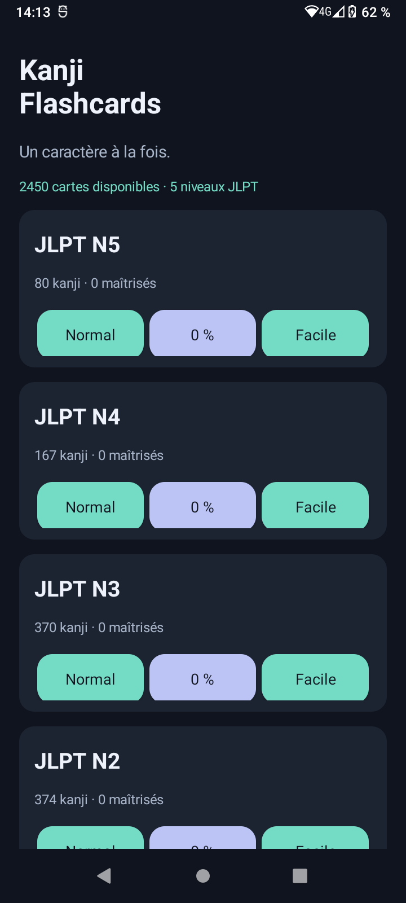
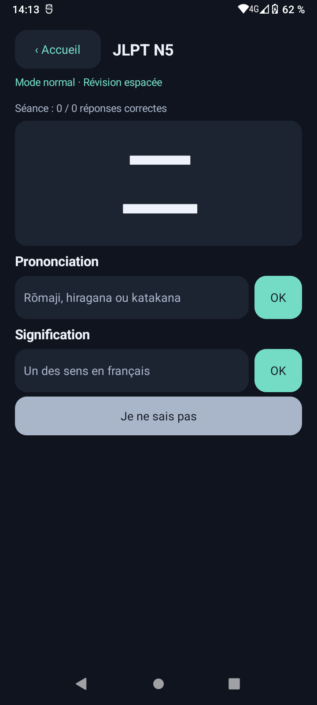
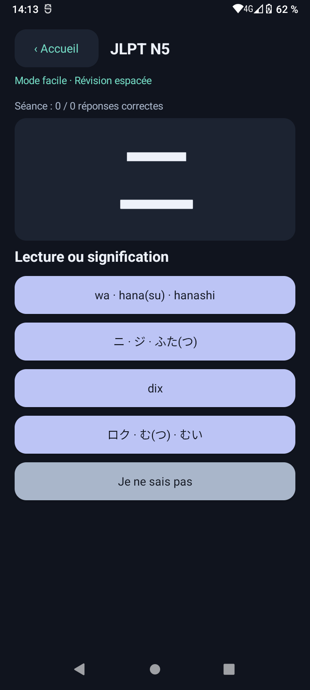
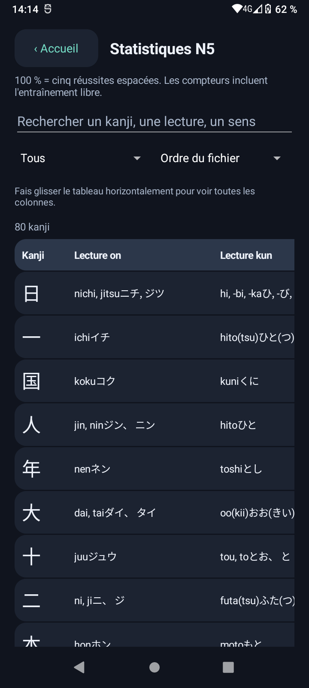
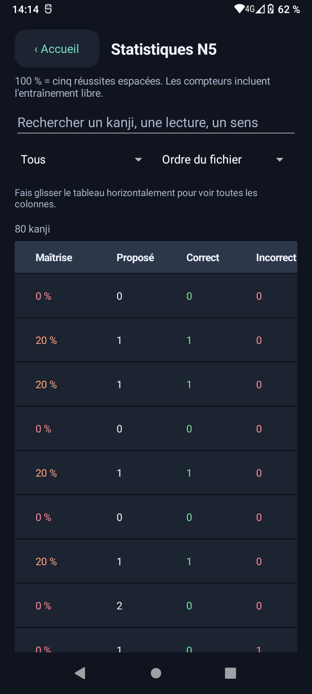

# Kanji Flashcards


Application Android native en Kotlin, en français et en thème sombre. Compatible avec Android 8 et versions suivantes, notamment Android 12. Elle fonctionne entièrement hors ligne, sans compte, publicité ni permission réseau.

Le dépôt du projet est [ryosama/android-kanji-flashcard](https://github.com/ryosama/android-kanji-flashcard). Le code et les commentaires sont en français.

## Captures d'écran

### Page d'accueil

La page d'accueil permet de choisir un niveau JLPT, de lancer une révision en mode normal ou facile et d'accéder aux statistiques de progression.



### Mode normal

Le mode normal affiche un kanji et deux champs pour saisir sa prononciation et une signification, avec un bouton de validation pour chaque réponse et le bouton « Je ne sais pas ».



### Mode facile

Le mode facile propose quatre réponses à sélectionner, ici un mélange de rōmaji, de kana et de français, ainsi que le bouton « Je ne sais pas ».



### Statistiques : lectures

La première vue des statistiques présente les kanji et leurs lectures on et kun, avec une recherche et des options de filtre et de tri.



### Statistiques : progression

Après un défilement horizontal, le tableau affiche le niveau de maîtrise, le nombre de présentations et les compteurs de réponses correctes et incorrectes.



## Installer l'application

Télécharger l'APK depuis la [dernière release GitHub](https://github.com/ryosama/android-kanji-flashcard/releases/latest), puis l'ouvrir sur le téléphone Android. Autoriser l'installation depuis la source utilisée si Android le demande.

Pour remplacer une ancienne version de test, exporter d'abord la progression en TSV, désinstaller cette version, installer la release puis importer sa progression. Les signatures debug et release sont différentes.

## Fonctionnement

- 2 495 kanji provenant des cinq CSV français fournis, du JLPT N5 au N1.
- Mode normal : saisir une lecture et un sens, puis valider chaque champ avec OK. Une lecture valide parmi les lectures on/kun suffit. Le bouton « Je ne sais pas » termine la carte comme une erreur et révèle la correction. Les formes complètes et les radicaux indiqués par les parenthèses sont acceptés, ainsi que les hiragana et katakana équivalents.
- Mode facile : choisir signification, rōmaji, kana ou mélange. Chaque bouton regroupe toutes les lectures on/kun du format choisi, avec les parenthèses optionnelles conservées, ou toutes les significations françaises, séparées par « · ». Chaque question propose quatre réponses distinctes, sans distracteur qui serait une réponse valide pour la carte courante. Le mode Mélange combine français, rōmaji et kana au sein des quatre propositions, avec les trois formats présents et une seule bonne réponse. Le bouton supplémentaire « Je ne sais pas » compte comme une mauvaise réponse et affiche la correction avant le passage à la carte suivante.
- Correction : insensible aux majuscules, accents français, ponctuation et espaces superflus. Une faute est tolérée à partir de cinq lettres, deux à partir de dix ; une transposition adjacente compte pour une faute. Les mots courts restent stricts. Seuls les sens présents dans le catalogue sont acceptés ; les précisions entre parenthèses sont facultatives (par exemple « droite » pour « droite (direction) »).
- Équivalences de lecture : `oo`, `ou`, `ô`, `ō`, ainsi que `tchi` et `chi`. Aucune correction approximative générale des lectures, pour conserver les distinctions entre sons japonais.
- Progression commune aux deux modes. Chaque carte commence à 0 %. Les réussites successives lors des révisions dues conduisent à 20, 40, 60, 80 puis 100 %, avec des intervalles de 1, 2, 4, 8 puis 16 jours. Une erreur ramène à 0 % et programme la carte pour le lendemain. À 100 %, la carte reste à revoir tous les 16 jours ; une erreur la ramène aussi à 0 %.
- Les cartes dues sont tirées au hasard, avec évitement de la répétition immédiate lorsque plusieurs sont disponibles. Tous les nouveaux kanji sont immédiatement disponibles.
- Séance sans limite. Lorsque les cartes sont à jour, l'entraînement libre reste disponible. Il affecte les compteurs mais conserve le palier et l'échéance.
- Le pourcentage d'accueil représente la proportion de kanji à 100 %, arrondie à l'entier inférieur. Le tableau montre aussi les lectures, sens, maîtrise, présentations, succès et erreurs. Recherche, filtres et tri sont disponibles ; les lignes sont chargées par groupes de 50.
- Une présentation est comptée dès qu'une carte s'affiche. Une réponse n'est comptée qu'une fois la question complètement validée. Quitter une carte ne compte pas comme une erreur. Une rotation conserve la carte et les saisies sans doubler les compteurs.

## Sauvegardes

La progression est enregistrée dans l'espace privé de l'application par écriture atomique. Dans « Sauvegarde et réglages », exporter un fichier `kanji-progression.tsv` avec le sélecteur de fichiers Android, puis l'importer sur un autre téléphone. Le format est ouvert, versionné et sans information personnelle.

L'import valide tout le fichier avant de proposer une confirmation. Il remplace ensuite la progression de tous les niveaux. Une sauvegarde invalide ne modifie pas les données existantes. Une remise à zéro par niveau est disponible avec confirmation. La désinstallation supprime les données locales : exporter avant de désinstaller. L'application ne configure aucune sauvegarde automatique en ligne.

## Compilation

```bash
git clone https://github.com/ryosama/android-kanji-flashcard.git
cd android-kanji-flashcard
```

Outils : JDK 17, Gradle 8.11.1, Android SDK plateforme 36 et build-tools 35.0.0. Plugins Android 8.9.3 et Kotlin 2.1.20, versions fixes. Le projet utilise les composants natifs Android et n'exige pas de bibliothèque d'interface supplémentaire.

Définir `JAVA_HOME` et `ANDROID_HOME`, ou installer les outils dans `.tools/jdk`, `.tools/android-sdk` et `.tools/gradle-8.11.1`. Le répertoire `.tools` et `local.properties` sont exclus de Git. Le wrapper Gradle permet aussi de télécharger Gradle sur un nouvel environnement.

Installer les composants Android avec le gestionnaire de SDK d'Android Studio, ou avec les outils en ligne de commande du SDK :

```bash
sdkmanager 'platforms;android-36' 'build-tools;35.0.0'
```

Le script accepte également `ANDROID_SDK_ROOT` et respecte `GRADLE_USER_HOME` si ces variables sont déjà définies.

```bash
./scripts/build.sh
# En réutilisant des dépendances déjà téléchargées :
./scripts/build.sh --offline :core:check :app:assembleDebug :app:lintDebug
```

Pour préparer un APK signé destiné à une release, utiliser `./scripts/build-release.sh` avec la configuration privée décrite dans [PUBLICATION.md](PUBLICATION.md).

APK de test : `app/build/outputs/apk/debug/app-debug.apk`. Il s'agit d'une version de test signée avec une clé de développement, pas d'une publication finale.

Après avoir activé le débogage USB et autorisé l'ordinateur sur le téléphone :

```bash
adb install -r app/build/outputs/apk/debug/app-debug.apk
```

Le workflow [Android](.github/workflows/android.yml) exécute les vérifications du moteur, la compilation et Android Lint à chaque push sur `main` et à chaque pull request. Il fournit l'APK de test et les rapports dans les artefacts du lancement, accessibles depuis l'onglet **Actions**. Les étapes utilisent des versions d'actions fixées par leur identifiant de commit.

## Organisation

- [Guide de lecture et de modification du code](CODE_GUIDE.md) : rôle de chaque fichier, composants graphiques et circulation des données.
- `core` : import CSV, correction, moteur Leitner, QCM et format de sauvegarde ; vérifications indépendantes d'Android.
- `app` : activité de coordination, état de séance, fichiers privés et export/import.
- `app/src/main/java/fr/kanjiflashcards/ui/screens` : un fichier par écran (accueil, normal, facile, statistiques, réglages).
- `app/src/main/java/fr/kanjiflashcards/ui` : palette et fonctions graphiques partagées, présentation commune aux révisions.
- `listes/francais` : CSV sources, intégrés directement aux ressources de l'application.
- `design UI` : maquettes SVG d'origine.

Les tests parcourent toutes les cartes et les quatre types de QCM, vérifient les collisions de réponses, les délais Leitner, les limites de correction et les sauvegardes invalides.

La préparation du dépôt et les commandes de publication sont décrites dans [PUBLICATION.md](PUBLICATION.md). Aucun compte GitHub, secret ou identité de développeur n'est nécessaire à la compilation.

Le code est publié sans licence pour le moment, selon le choix du mainteneur.
